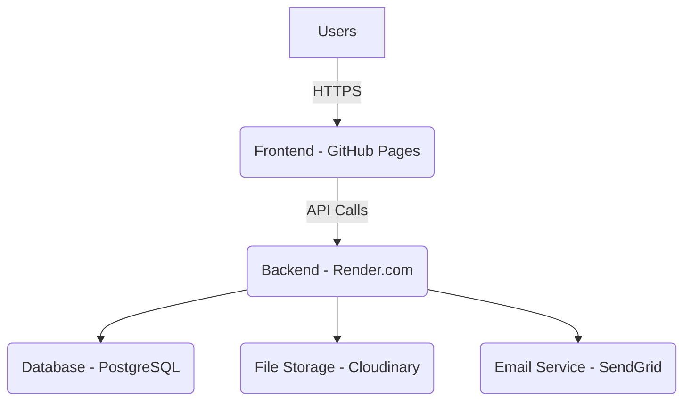

# Diwan Al-Maarifa - System Architecture

**Date**: December 15, 2025

---

## 1. Overview

Diwan Al-Maarifa is a web-based platform designed to enrich Arabic scientific content. It allows contributors to submit articles and scientific terms, which are then reviewed and published. The system is built with a modern, scalable architecture to ensure reliability and performance.

## 2. System Components

The platform consists of two main components:

1.  **Frontend**: A static website built with HTML, CSS, and JavaScript, hosted on GitHub Pages. It provides the user interface for content consumption, submission, and user management.
2.  **Backend**: A Node.js API server built with Express.js, hosted on Render.com. It handles business logic, data storage, user authentication, and external service integrations.

### Architecture Diagram

## 3. Frontend Architecture

-   **Framework**: Vanilla JavaScript, HTML5, CSS3
-   **Styling**: Bootstrap 5 for layout and components, custom CSS for branding.
-   **Deployment**: GitHub Pages, automatically deployed on push to the `main` branch.
-   **Key Libraries**:
    -   **Bootstrap**: Responsive design and UI components.
    -   **Font Awesome**: Icons.
    -   **Custom JavaScript**: For API interaction, authentication, and dynamic content rendering.

## 4. Backend Architecture

-   **Framework**: Node.js with Express.js.
-   **Database**: PostgreSQL for relational data storage.
-   **Authentication**: JWT (JSON Web Tokens) for stateless authentication.
-   **File Storage**: Cloudinary for storing user-uploaded images and documents.
-   **Email Service**: SendGrid for transactional emails (notifications).
-   **Deployment**: Render.com, with continuous deployment from the `main` branch of the backend repository.

## 5. Data Model

The database schema is designed to be relational and scalable. Key tables include:

-   `users`: Stores user information, roles, and authentication details.
-   `content_submissions`: The core table for articles and terms, including their status (draft, pending_review, published, etc.).
-   `categories`: Stores the scientific fields.
-   `content_attachments`: Stores metadata about uploaded files.
-   `email_notifications`: Logs all outgoing emails.

For a detailed schema, refer to the database migration files in the backend repository.

## 6. Feature Implementation Details

### Content Submission

1.  Users fill out a form in a modal on the frontend.
2.  The frontend sends the data to the `/api/content/submit` endpoint.
3.  The backend validates the data, creates a new entry in `content_submissions` with a `pending_review` status.
4.  An email notification is sent to the admin email address.

### File Uploads

1.  The frontend uses a drag-and-drop interface to handle file selection.
2.  Files are uploaded directly to the backend `/api/upload/multiple` endpoint.
3.  The backend uses `multer` to process the files and streams them to Cloudinary.
4.  The file metadata (URL, size, type) is stored in the `content_attachments` table.
5.  The attachment is linked to the content submission via a foreign key.

### Email Notifications

1.  The backend uses the SendGrid API to send emails.
2.  Email templates are stored in the backend and rendered with dynamic data.
3.  All sent emails are logged in the `email_notifications` table for tracking.

## 7. Security

-   **Authentication**: JWT tokens are used to secure private endpoints.
-   **Data Validation**: All user input is validated on both the frontend and backend.
-   **File Uploads**: Files are validated by type and size, and stored in a separate cloud service to prevent security risks.
-   **CORS**: The backend has a strict CORS policy to only allow requests from the frontend domain.
-   **Environment Variables**: All sensitive information (API keys, database credentials) is stored in environment variables and not in the codebase.

## 8. Scalability

-   **Stateless Backend**: The backend is stateless, allowing for horizontal scaling by adding more instances on Render.com.
-   **Cloud Services**: Using managed services like PostgreSQL, Cloudinary, and SendGrid allows for easy scaling of these components.
-   **CDN**: GitHub Pages provides a global CDN for the frontend, ensuring fast load times for users worldwide.
